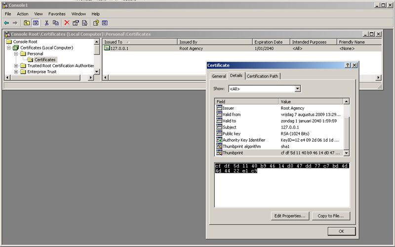

# WCF over HTTPS

## Introduction

A couple of weeks ago I was asked to write a web service that needed to provide a single operation (method) that allowed the user to upload a file using a Secure Sockets Layer (SSL / HTTPS) .

Although they changed their minds and went for a solution using a VPN connection, I still decided to create the web service in case they went back on their decision again.

This article outlines the steps you need to follow in order to create a service to upload a file over HTTPS using WCF. And it's been quite a while since I wrote my last article for this blog. I figured this would make an interesting topic...

## WCF Service Contract

Let's start by laying the groundwork for the WCF Service. As stated the service must enable users to upload a file to the web server which hosts it. Thus the resulting service contract only contains one method, aptly named Upload(...).

Start by opening up Visual Studio 2008 and create a new blank solution called WcfOverHttps. Next add a new WCF Service Library titled CGeers.Wcf.Services. This class library contains some automatically generated files (IService1.cs, Service.cs, App.config). Rename the IService.cs file to IFileUploadService.cs.

**Figure 1** - Solution Explorer


The code for the service contract is displayed in Listing 1:

**Listing 1** - Service Contract

```csharp
[ServiceContract(Namespace = "https://cgeers.wordpress.com/wcf/services")]
public interface IFileUploadService
{
    [OperationContract]
    FileReceivedInfo Upload(FileInfo fileInfo);
}
```

As you can see displayed in Figure 1 and Listing 1 above they mention two other classes, namely:

1. FileInfo
2. FileReceivedInfo

These classes are both decorated with the [MessageContract](http://msdn.microsoft.com/en-us/library/system.servicemodel.messagecontractattribute.aspx) attribute. To upload the file I opted to use streaming. WCF stipulates that the parameter that holds the data to be streamed must be the only parameter in the method.

You could opt to change the type of the fileInfo parameter to Stream, but then you cannot send any additional information about the file along with it. You can circumvent this issue by creating a new class which contains all of the information you want to transmit. By decorating this class with the MessageContract attribute you can use this class (or message) as a parameter or return type in your service operations.

The FileInfo class specifies the structure of a SOAP envelope for a particular message.

**Listing 2** - FileInfo class

```csharp
[MessageContract]
public class FileInfo
{
    [MessageHeader(MustUnderstand = true)]
    public string FileName { get; set; }

    [MessageHeader(MustUnderstand = true)]
    public long Length { get; set; }

    [MessageBodyMember(Order = 1)]
    public Stream Stream { get; set; }
}
```

As you can see in Listing 2 the FileInfo class contains three properties. Apart from the actual file (Stream property) the filename and length of the file are also provided.

By applying the [MessageHeader attribute](http://msdn.microsoft.com/en-us/library/system.servicemodel.messageheaderattribute.aspx) to the FileName and Length propery you place this information in the header of the SOAP message. When streaming a file the body of the SOAP message must only contain the actual file itself. By applying the [MessageBodyMember attribute](http://msdn.microsoft.com/en-us/library/system.servicemodel.messagebodymemberattribute.aspx) to the Stream property you place it in the body of the SOAP message.

If your service operation contains a parameter of a type which has been decorated with the MessageContract attribute then all of the parameters and the return type used in this operation must be of a type to which this attribute has been applied.

You cannot mix parameters of a primitive type with message contracts. For instance if you want the Upload(...) method to return a boolean indicating if the upload succeeded or failed then you have to wrap this in another message contract.

Listing 3 displays how to setup the return value as a message contract. Apart from the boolean value (body) the header of this SOAP message contains the filename of the uploaded file and an optional message property which contains some information about why the upload failed.

**Listing 3** - FileReceivedInfo class

```csharp
[MessageContract]
public class FileReceivedInfo
{
    [MessageHeader(MustUnderstand = true)]
    public string FileName { get; set; }

    [MessageHeader(MustUnderstand = true)]
    public string Message { get; set; }

    [MessageBodyMember(Order = 1)]
    public bool UploadSucceeded { get; set; }
}
```

If you try to mix message contracts and parameters of a primitive type you'll receive the following error message:

_System.InvalidOperationException: The operation 'Method' could not be loaded because it has a parameter or return type of type System.ServiceModel.Channels.Message or a type that has MessageContractAttribute and other parameters of different types. When using System.ServiceModel.Channels.Message or types with MessageContractAttribute, the method must not use any other types of parameters._

## Service Implementation

Now that the contract for the service has been established it's time to provide an actual implementation for it.

Start by renaming the Service1.cs file to FileUploadService.cs and add a reference to the System.Configuration assembly.

Listing 4 displays the code for implementing the service. The code is pretty straightforward. Check out the comments in the code for more explanation. Basically it reads the incoming stream and saves it to a file using familiar .NET code.

The Upload(...) method's return type is of the FileReceivedInfo type. If the upload succeeds the UploadSucceeded property is set to true, if it fails this property is set to false and the message property is populated with the message property of the exception that occured.

**Listing 4** - Service Implementation

```csharp
[ServiceBehavior(InstanceContextMode = InstanceContextMode.PerCall,
    ConcurrencyMode = ConcurrencyMode.Single)]
public class FileUploadService : IFileUploadService
{
    #region IFileUploadService Members

    public FileReceivedInfo Upload(FileInfo fileInfo)
    {
        try
        {
            // Determine to which directory the file needs to be uploaded
            string uploadDirectory =
                ConfigurationManager.AppSettings["uploadDirectory"];
            if (String.IsNullOrEmpty(uploadDirectory))
            {
                throw new InvalidOperationException("...");
            }

            // Try to create the upload directory if it does not yet exist
            if (!Directory.Exists(uploadDirectory))
            {
                Directory.CreateDirectory(uploadDirectory);
            }

            // Check if a file with the same filename is already
            // present in the upload directory. If this is the case
            // then delete this file
            string path = Path.Combine(uploadDirectory, fileInfo.FileName);
            if (File.Exists(path))
            {
                // Check if the file is read-only
                if ((File.GetAttributes(path) & FileAttributes.ReadOnly) ==
                    FileAttributes.ReadOnly)
                {
                    File.SetAttributes(path, FileAttributes.Normal);
                }
                File.Delete(path);
            }

            // Read the incoming stream and save it to file
            const int bufferSize = 2048;
            byte[] buffer = new byte[bufferSize];
            using (FileStream outputStream = new FileStream(path,
                FileMode.Create, FileAccess.Write))
            {
                int bytesRead = fileInfo.Stream.Read(buffer, 0, bufferSize);
                while (bytesRead > 0)
                {
                    outputStream.Write(buffer, 0, bytesRead);
                    bytesRead = fileInfo.Stream.Read(buffer, 0, bufferSize);
                }
                outputStream.Close();
            }
            return new FileReceivedInfo
                       {
                           FileName = fileInfo.FileName,
                           Message = String.Empty,
                           UploadSucceeded = true
                       };
        }
        catch (Exception ex)
        {
            return new FileReceivedInfo
                       {
                           FileName = fileInfo.FileName,
                           Message = ex.Message,
                           UploadSucceeded = false
                       };
        }
    }

    #endregion
}
```

## Hosting The Service

Now that the service has been setup it's time to create a host for it. To keep things simple a console application will do. Add a new Console Application project to your solution named ConsoleHost. Next add references to the System.ServiceModel assembly and the CGeers.Wcf.Services project.

The code for the Main(...) method of the console application is slim and simple. Take a look at Listing 5.

**Listing 5** - Hosting the FileUpload service

```csharp
static void Main(string[] args)
{
    ServiceHost host = new ServiceHost(typeof(FileUploadService));
    host.Open();
    Console.WriteLine("FileUpload Service Host");
    Console.WriteLine("Service Started!");
    foreach (Uri address in host.BaseAddresses)
    {
        Console.WriteLine("Listening on " + address);
    }
    Console.WriteLine("Press any key to close the host...");
    Console.ReadKey();
    host.Close();
}
```

A new ServiceHost instance is created for the FileUploadService type and the host is then started. But before you launch the console application you still need to configure the service. Instead of doing this through code I opted to do this via an application configuration file. The next section addresses how you can easily configure your service.

## Configuring The Host

Start by adding an application configuration (App.config) file to the ConsoleHost project. Next specify the directory in which the service should save the incoming files.

**Listing 6** - Upload directory

```xml
<appSettings>
  <add key="uploadDirectory" value="C:\temp\upload" />
</appSettings>
```

Now add a node to the configuration file. Within this node three child nodes will be added in order to configure the service. The first such node specifies the service's behavior.

**Listing 7** - Service Behavior

```xml
<behaviors>
  <serviceBehaviors>
    <behavior name="FileUploadServiceBehavior">
      <serviceMetadata httpGetEnabled="False" httpsGetEnabled="True" />
      <serviceDebug includeExceptionDetailInFaults="False" />
    </behavior>
  </serviceBehaviors>
</behaviors>
```

The behavior specifies that the service should not propagate exception details and that it's metadata should be shared over HTTPS (httpsGetEnabled) instead of HTTP (httpGetEnabled).

Next up is the binding for the service. Since the goal is to use HTTPS the built-in BasicHttpBinding fits the bill. A couple of its properties need to be tweaked to fit the needs of the service, namely:

1. **transferMode**: Set it to Streamed to enable streaming.
2. **messageEncoding**: The message encoding is set to [MTOM encoding](http://msdn.microsoft.com/en-us/library/aa395209.aspx) which is a mechanism for transmitting binary attachements with SOAP messages.
3. **maxReceivedMessageSize**: Set to 64 megabytes to allow large files to be uploaded.
4. **maxBufferSize**: Set to 64 kilobytes.
5. **receiveTimeout**: Set to 10 minutes. If the file fails to upload within this time frame an exception will be thrown.

**Remark**: Configure these settings according to the needs of your application. For my application a maximum of 64 Mb for the file size and 64 KB for the buffer are sufficient.

**Listing 8** - The Binding

```xml
<bindings>
  <basicHttpBinding>
    <!-- buffer: 64KB; max size: 64MB -->
    <binding name="FileUploadServiceBinding"
             transferMode="Streamed"
             messageEncoding="Mtom"
             maxReceivedMessageSize="67108864" maxBufferSize="65536"
             closeTimeout="00:01:00" openTimeout="00:01:00"
             receiveTimeout="00:10:00" sendTimeout="00:01:00">
      <security mode="Transport">
        <transport clientCredentialType="None" />
      </security>
    </binding>
  </basicHttpBinding>
</bindings>
```

Last but not least is the configuration for the service itself.

**Listing 9**: FileUploadService configuration

```xml
<services>
  <service behaviorConfiguration="FileUploadServiceBehavior"
    name="CGeers.Wcf.Services.FileUploadService">
    <endpoint address="" binding="basicHttpBinding" contract="CGeers.Wcf.Services.IFileUploadService"
              bindingConfiguration="FileUploadServiceBinding">
      <identity>
        <dns value="localhost" />
      </identity>
    </endpoint>
    <endpoint address="mex" binding="mexHttpsBinding" contract="IMetadataExchange" />
    <host>
      <baseAddresses>
        <add baseAddress="https://127.0.0.1:8741/FileUploadService/" />
      </baseAddresses>
    </host>
  </service>
</services>
```

The service's ABC's are specified and it's hooked up to the behavior and binding we configured earlier. The address https://127.0.0.1:8741/FileUploadService/ is specified as being the location of the service. As you can see in the service's binding the security is set to Transport which requires that you provide an HTTPS based address.

**Remark**: Note that for the metadata exchange (mex) the mexHttpsBinding is specified and not the default mexHttpBinding.

If you run the ConsoleHost project now you receive the following result:

**Figure 2** - ConsoleHost


## SSL Certificate

If you run the ConsoleHost project now and enter the address https://127.0.0.1:8741/FileUploadService/ in a browser you'll receive an error. Before you can proceed , you need to bind an SSL Certificate to port 8741 for the IP address 127.0.0.1.

First you need to create an SSL certificate. You can do this using the makecert.exe command-line utility. Just start a new Visual Studio command prompt and enter the following command in order to create a X509 certificate which will be used for SSL communication on the localhost (127.0.0.1).

makecert.exe -sr LocalMachine -ss My -n CN=127.0.0.1 -sky exchange -sk -pe

After this command is executed, the new certificate with the private key is created and stored in the LocalMachine Personal store. To see it, use the MMC-certificate snap-in.

After executing this command your new certificate is created and stored in the LocalMachine Personal store. Open the MMC-certificate snap-in to see it.

1. Click Start, Run and enter the command "mmc"
2. Click OK to start the MMC console
3. Click File | Add/Remove snap-in...
4. In the resulting dialog that pops up click the Add option and choose the Certificates snap-in
5. Confirm your changes by closing the dialog windows

Afterwards you can view you new certificate in the MMC console as displayed in Figure 3.

**Figure 3** - MMC Console Certificates snap-in



Next you need to bind this new certificate to the port 8741. Return to the Visual Studio command prompt and enter the following command to do so:

httpcfg.exe set ssl -i 127.0.0.1:8741 -h cfdf5d1140b94614d047dd77c7bd4d4d4422e1c9 -Personal

Replace the "cfdf5d1140b94614d047dd77c7bd4d4d4422e1c9" value with the thumbprint of your own certificate. You can retrieve the thumbprint using the Certificates MMC snap-in as shown in Figure 3. Be sure to remove all the spaces.

If you rerun the ConsoleHost application after creating the certificate and binding it to 127.0.0.1:8741 you should receive the standard WCF service test page after entering the address https://127.0.0.1:8741/FileUploadService/ in a browser.

**Figure 4** - FileUploadService


## Client Application

Voila, now that the file upload service is ready we can begin to consume it. Let's test this...

Add a new console application project named ConsoleClient to your solution. Next add a reference to the System.ServiceModel assembly. When done start the ConsoleHost application in non-debug mode. We need to add a reference to this service to the client application. For this the service needs to be up and running.

Right click on the ConsoleClient project within the Solution Explorer and choose "Add Service Reference...". The Add Service Reference dialog is displayed. Enter the address of the service (https://127.0.0.1:8741/FileUploadService/) in the address field and click Go. The SSL certificate will be presented to the calling application (= Visual Studio). You'll be prompted to accept the certificate. Click Yes to proceed.

**Figure 5** - SSL Certificate Security Alert In Visual Studio 2008


Rename the namespace ServiceReference1 to ServiceReferences and click Advanced. The Service Reference Settings dialog is shown. Make sure that the option "Always generate message contracts" is checked. Click OK to close this dialog. Click OK once more to let Visual Studio add the service reference and generate the necessary proxy classes.

**Remark**: If you don't check the option "Always generate message contracts" then the message contract's properties will appear as individual parameters in the proxy. And for the result type you'll only get the property that is marked as the body of the SOAP message.

Unchecked the Upload(...) method on the proxy will be generated as such:

**Listing 10**: Always Generate Message Contracts

```csharp
bool Upload(string fileName, long length, Stream stream);
```

instead of

```csharp
FileReceivedInfo Upload(FileInfo fileInfo);
```

Once the necessary proxy classes have been generated consuming the service is an easy task. Consider the following code in the Main(...) method of the ConsoleClient application.

**Listing 11** - ConsoleClient Application

```csharp
using (FileUploadServiceClient proxy = new FileUploadServiceClient())
{
    FileStream inputStream = File.Open(@"c:\temp\uploadtest.txt", FileMode.Open);

    ServiceReferences.FileInfo fileInfo =
        new ServiceReferences.FileInfo("uploaded.txt", inputStream.Length, inputStream);
    FileReceivedInfo info = proxy.Upload(fileInfo);
    if (info.UploadSucceeded)
    {
        Console.WriteLine(String.Format("File {0} uploaded", info.FileName));
    }
    else
    {
        Console.WriteLine(String.Format("File {0} upload failed", info.FileName));
        Console.WriteLine(info.Message);
    }
    Console.WriteLine();
    Console.ReadLine();
}
```

## Authenticate The Server

Make sure the ConsoleHost application is still running and start the ConsoleClient application for the first time. Upon hitting the line of code that calls the Upload(...) method on the proxy you'll receive the following error message:

_Could not establish trust relationship for the SSL/TLS secure channel with authority '127.0.0.1:8741'._

This means that the server (ConsoleHost) presented the SSL certificate to the client application during the handshake and the client did not validate it. Thus a trusted relationship for the SSL/TLS secure channel could not be established.

To solve this problem add the following code to the beginning of the Main(...) method of the ConsoleClient application.

**Listing 12** - Validating The Server

```csharp
ServicePointManager.ServerCertificateValidationCallback += customXertificateValidation;
The code for the customXertificateValidation(…) method is as follows:

private static bool customXertificateValidation(object sender, X509Certificate cert,
    X509Chain chain, SslPolicyErrors error)
{
    X509Certificate2 certificate = (X509Certificate2)cert;
    if (certificate.Subject == "CN=127.0.0.1" && !String.IsNullOrEmpty(certificate.Thumbprint) &&
        certificate.Thumbprint.ToLower() == "cfdf5d1140b94614d047dd77c7bd4d4d4422e1c9")
    {
        return true;
    }
    return false;
}
```

When the customXertificateValidation(...) method is called (callback) by WCF to validate the server certificate you have the opportunity to inspect the certificate (= cert parameter). In this example the value of the Subject and Thumbprint are checked in order to validate the identity of the server. If they match then the server is authenticated, if not then the SSL connection cannot be established.

**Remark**: Feel free to adjust the validation of the SSL certificate to suit your own needs.

Upon running the client again after applying these changes you'll receive the message "File uploaded.txt uploaded".

## Authenticate The Client

At this point you could consider your file upload service complete, but one crucial item remains. Namely authenticating the client by the server.

I don't want anyone who happens to stumble upon my service to be able to upload files to the web server. To block unauthorized users we have to validate the client. Luckily WCF allows you do so without much hassle.

Let's return to the CGeers.Wcf.Service project for a while. Add a reference to the System.IdentityModel assembly and add a new class called CustomUserNameValidator.

**Listing 13** - CustomUserNameValidator

```csharp
public class CustomUserNameValidator : UserNamePasswordValidator
{
    public override void Validate(string userName, string password)
    {
        if (userName != "Christophe" || password != "WCFRocks!")
        {
            // This throws an informative fault to the client.
            throw new FaultException("Incorrect username or password");
        }
    }
}
```

This class derives from the UserNamePasswordValidator which can be found in the System.IdentityModel.Selectors namespace. Only one method needs to be overriden, namely the Validate(...) method. Here you need to specify your own custom code in order to validate the provided username and password. Just throw a FaultException if you cannot validate the user.

Next you need to configure the ConsoleHost application so that it uses the CustomUserNameValidator class in order to validate the clients. Open the App.config file of the ConsoleHost application and adjust the following settings:

For the basicHttpBinding set the required clientCredentialType of the transport security to Basic. This requires that the client present the necessary credentials (username & password).

**Listing 14** - Adjusting The Binding

```xml
...
<security mode="Transport">
  <transport clientCredentialType="Basic" />
</security>
...
```

Then add the following bit of configuration to the service behavior to tell the service how to validate the client credentials.

**Listing 15** - Adjusting The Service Behavior

```xml
...
<serviceCredentials>
  <userNameAuthentication
    userNamePasswordValidationMode="Custom"
    customUserNamePasswordValidatorType="CGeers.Wcf.Services.CustomUserNameValidator, CGeers.Wcf.Services" />
</serviceCredentials>
...
```

The service is now correctly setup and requires the client to provide the necessary credentials. If you run the ConsoleClient application now you'll receive the following error message:

_The HTTP request is unauthorized with client authentication scheme 'Anonymous'. The authentication header received from the server was 'Basic realm=""'._

The configuration for the client application needs to reflect the changes we made to the service. Right click on the service reference and choose "Update Service Reference".

Running the client application again will now result in the following error message:

_The HTTP request was forbidden with client authentication scheme 'Basic'._

You still need to adjust the client application so that it passes the correct credentials to the service. Add the following lines of code to the ConsoleClient's Main(...) method.

**Listing 16** - Client Credentials

```csharp
...
proxy.ClientCredentials.UserName.UserName = "Christophe";
proxy.ClientCredentials.UserName.Password = "WCFRocks!";
...
```

That's it! The client will now present valid credentials to the service and an SSL connection will be established.

**Remark**: The username and password validation in this article is kept short for illustrative purposes. Replace this with you're own validation logic in real-world applications. A better approach would be to validate the username and password against a database containing the user's credentials.

## Summary

I hope you enjoyed this tutorial on how to transfer files over HTTPS using WCF. To recap what we've covered from a developer's point of view:

- Streaming a file over WCF
- Configuring a WCF service for communication over HTTPS(directories)
- Generating and binding a test SSL certificate to a port
- Consuming a service over HTTPS
- Authenticating the server
- Authenticating the client
